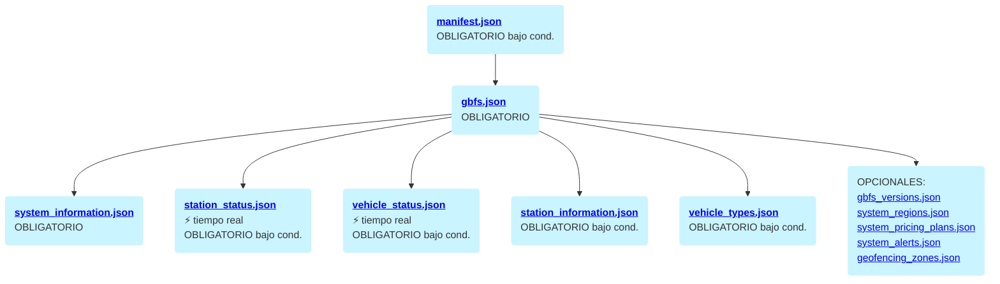
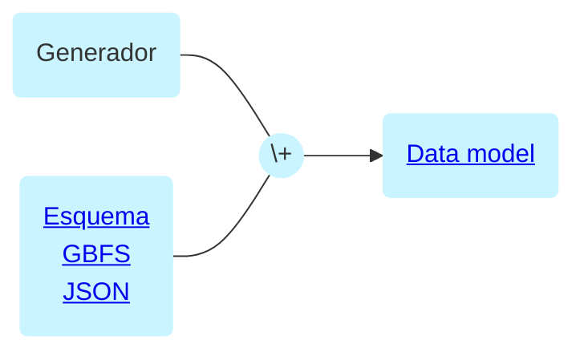

# Guía de implementación para productores de GBFS

## Introducción

Esta guía está destinada a equipos técnicos de servicios de movilidad compartida. En esta guía encontrará recomendaciones y recursos para publicar el estado de su sistema de movilidad en formato GBFS (Especificación general de alimentación de bicicletas compartidas). Utilice esta guía además de la [referencia de GBFS](https://github.com/MobilityData/gbfs/blob/master/gbfs.md).

## Propósito de GBFS

La Especificación general de alimentación de bicicletas compartidas (GBFS) se creó en 2014 por [Mitch Vars](https://github.com/mplsmitch), que luego fue adoptado por [NABSA](https://nabsa.net/), para estandarizar la forma en que los sistemas de bicicletas compartidas se comunican con las aplicaciones de planificación de trip.

Desarrollado por MobilityData desde 2019 y transferido oficialmente a MobilityData en 2022, GBFS ha evolucionado para permitir [más de 1000](https://github.com/MobilityData/gbfs/blob/master/systems.csv) sistemas acoplados y sin acoplamiento en todo el mundo, como scooters, ciclomotores y coches compartidos aparecerán en las aplicaciones de planificación de trip.


_GBFS es un formato de datos estandarizado utilizado por [más de 1000](https://github.com/MobilityData/gbfs/blob/master/systems.csv) servicios de movilidad compartidos en todo el mundo para aparecer en planificadores de trip y otras aplicaciones de consumo._

## Descripción general de un feed GBFS

GBFS es una especificación de datos basada en extracción en tiempo real que describe el estado actual de un sistema de movilidad.

Un feed GBFS se compone de una serie de archivos JSON. Cada archivo modela un aspecto particular de un sistema de movilidad: estado de vehículos y/o estaciones, reglas geográficas, precios, etc. Los detalles de cada archivo se definen en la [referencia GBFS](https://github.com/MobilityData/gbfs/blob/master/gbfs.md) con ejemplos.

<div style="zoom: 1.5; font-weight:bold;">

</div>

_La aplicación consumidora solicita el estado actual del sistema de movilidad al operador, quien responde con los feeds GBFS en formato JSON._

## Hacer que un feed GBFS esté disponible públicamente

Los feeds públicos permiten la integración de servicios de movilidad compartidos con el transporte público. GBFS respeta la privacidad del usuario ya que no contiene ningún dato del usuario.

La forma más sencilla de hacer público un feed es alojarlo en un servidor web o exponerlo a través de una API y publicar un anuncio que lo haga disponible para su uso.

Una lista de archivos compartidos Los servicios de movilidad que brindan transmisiones públicas están disponibles en el catálogo MobilityData [systems.csv](https://github.com/MobilityData/gbfs/blob/master/systems.csv). Permite a los desarrolladores crear software sobre él, proporciona una fuente para proyectos de investigación y demuestra el alcance de la especificación en todo el mundo.

Si tiene o conoce un sistema que no aparece en la lista, agréguelo abriendo un extracto. solicite o notifique a MobilityData en: [sharedmobility@mobilitydata.org](mailto:sharedmobility@mobilitydata.org).


_Foto de [Lucian Alexe](https://unsplash.com/@lucian_alexe?utm_source=unsplash&amp;utm_medium=referral&amp;utm_content=creditCopyText) en [Unsplash](https://unsplash.com/photos/3ZzOF5qqiEA?utm_source=unsplash&amp;utm_medium=referral&amp;utm_content=creditCopyText). Bruselas, Bélgica._

## Pasos de implementación

Esta guía divide el script de publicación del feed en 4 pasos: extraer, transformar, cargar y validar.

<div style="zoom: 1.5; font-weight:bold;">

</div>

_Estos 4 pasos permiten a cualquier operador de movilidad compartida publicar un feed GBFS válido._

### 1. Extraiga datos de su sistema de movilidad

Extraer los datos de su sistema de movilidad es el primer paso para publicar su estado actual.

#### Extraer datos desde un software de gestión de flotas de terceros

Si su sistema de movilidad está gestionado por un software de gestión de flotas, es posible que el proveedor que está utilizando ya ofrezca un complemento GBFS. Pregúntele a su proveedor de software actual si ofrece un complemento GBFS o considere este factor al elegir su proveedor. Algunos software ofrecen un complemento GBFS, que incluye, entre otros: [ATOM](https://www.atommobility.com/top-features/integrations), [Fifteen](https://fifteen.eu/en/recursos/blog/fifteen-control-the-management-centre-for-your-bike-sharing-fleet-1), [goUrban](https://gourban.co/gourban-apis/), [Joyride](https://joyride.city/apps/gbfs-general-bike-feed-specification/), [PBSC](https://www.pbsc.com/), [Flota urbana](https://urbansharing.com/), [Vulog](https://www.vulog.com/) y [Wunder Mobility](https://www.wundermobility.com/blog/how-to-use-a-mobility-data-api-to-construir-un-futuro-sostenible-para-lo-compartido).

Si el proveedor de software de gestión de flotas que está utilizando no ofrece un complemento GBFS, es posible que proporcione una API que pueda consultar para extraer el estado actual de su sistema de movilidad.

#### Extraer datos de un Software interno de gestión de flotas

Si construyó su sistema de movilidad internamente, puede leer el estado actual de su sistema de movilidad directamente desde su base de datos operativa. Los operadores generalmente eligen escribir su script de publicación de feeds en el mismo language de programación que el resto de su sistema.

Si planea crear un software de gestión de flotas interno, puede ser una buena idea que las tablas de la base de datos operativa utilicen el mismo estructura como la [referencia de GBFS](https://github.com/MobilityData/gbfs/blob/master/gbfs.md). Esta elección técnica hace que la publicación de feeds GBFS sea significativamente más fácil.

### 2. Transforme sus datos en una estructura GBFS
A continuación, deberá modelar los datos en la estructura GBFS.

#### La estructura GBFS

<div>

</div>

_Un conjunto de datos GBFS v3 se compone de 12 archivos JSON, algunos siempre obligatorio, otros obligatorio bajo ciertas condiciones y otros opcional. El archivo [manifest.json](https://github.com/MobilityData/gbfs/blob/master/gbfs.md#manifestjson) enumera las URL de descubrimiento automático para cada conjunto de datos GBFS producido por un editor._

Esta estructura fue diseñada para información separada en tiempo real (por ejemplo: [station_status.json](https://github.com/MobilityData/gbfs/blob/master/gbfs.md#station_statusjson) y [vehicle_status.json](https://github.com/MobilityData/gbfs/blob/master/gbfs.md#vehicle_statusjson)) a partir de información estática (por ejemplo: [system_information.json](https://github.com/MobilityData/gbfs/blob/master/gbfs.md#system_informationjson) , [station_information.json](https://github.com/MobilityData/gbfs/blob/master/gbfs.md#station_informationjson) y [vehicle_types.json](https://github.com/MobilityData/gbfs/blob/master/gbfs.md#vehicle_typesjson)). Esto hace posible tener una duración de caché más larga para la información que cambia con menos frecuencia.

#### Ejemplo de archivo station_status.json


_Foto de [Dylan Patterson](https://unsplash.com/@sonya7r3a?utm_source=unsplash&amp;utm_medium=referral&amp;utm_content=creditCopyText) en [Unsplash](https://unsplash.com/photos/OGaaDTtttvI?utm_source=unsplash&amp;utm_medium=referral&amp;utm_content=creditCopyText)_

Ejemplo de [station_status.json](https://github.com/MobilityData/gbfs/blob/master/gbfs.md#station_statusjson) archivo obligatorio para sistemas de movilidad basados ​​en estaciones:

```json
{
  "last_updated": "2023-07-30T13:45:29+02:00",
  "ttl": 0,
  "version": "3.0",
  "data": {
    "stations": [
      {
        "station_id": "station1",
        "last_reported": "2023-07-30T13:45:29+02:00",
        "num_vehicles_available": 10,
        "vehicle_types_available": [
          {
            "vehicle_type_id": "bike_type_1",
            "count": 10
          }
        ],
        "num_vehicles_disabled": 0,
        "num_docks_available": 3,
        "vehicle_docks_available": [
          {
            "vehicle_type_ids": ["bike_type_1", "bike_type_2"],
            "count": 3
          }
        ],
        "num_docks_disabled": 0,
        "is_installed": true,
        "is_renting": true,
        "is_returning": true
      },
      ... more stations
    ]
  }
}
```

#### Ejemplo de archivo vehicle_status.json


_Foto de[Elizabeth Woolner](https://unsplash.com/@elizabeth_woolner?utm_source=unsplash&amp;utm_medium=referral&amp;utm_content=creditCopyText) en [Unsplash](https://unsplash.com/photos/mHrwltZJbKk?utm_source=unsplash&amp;utm_medium=referral&amp;utm_content=creditCopyText)_

Ejemplo de [vehicle_status.json](https://github.com/MobilityData/gbfs/blob/master/gbfs.md#Vehicle_statusjson) archivo obligatorio para vehículos flotantes (sin muelle) y opcional para vehículos basados ​​en estaciones (acoplados):

```json
{
  "last_updated": "2023-07-30T13:45:29+02:00",
  "ttl": 0,
  "version": "3.0",
  "data": {
    "vehicles": [
      {
        "vehicle_id": "973a5c94",
        "last_reported": "2023-07-30T13:45:29+02:00",
        "lat": 12.345678,
        "lon": 56.789012,
        "is_reserved":false,
        "is_disabled":false,
        "rental_uris": {
          "android": "https://www.example.com/app?vehicle_id=973a5c94&platform=android",
          "ios": "https://www.example.com/app?vehicle_id=973a5c94&platform=ios",
          "web": "https://www.example.com/app?vehicle_id=973a5c94"
        },
        "vehicle_type_id": "bike_type_1",
        "current_range_meters": "6543.0",
        "current_fuel_percent": "0.65",
        "station_id": "station1",
        "home_station_id": "station1",
        "pricing_plan_id": "pricing_plan_1",
        "vehicle_equipment": [],
        "available_until": "2023-07-30T13:45:29+02:00"
      },
      ... more vehicles
    ]
  }
}
```

Para proteger la privacidad del usuario, los vehículos en alquiler activo no debería incluirse en este feed. Además, la identificación del vehicle debería rotarse después de cada viaje. Esto se aplica a `vehicle_id` y a los enlaces profundos en `rental_uris` en [vehicle_status.json](https://github.com/MobilityData/gbfs/blob/master/gbfs.md#vehicle_statusjson) Puede encontrar más información sobre la implementación de identificaciones de vehicle rotativas en el blog de ingeniería [publicación por TIER](https://tier.engineering/How-we-anonymize-user-trips-on-public-APIs).

#### Utilice la versión actual de GBFS

Utilice la [versión actual](https://github.com/MobilityData/gbfs/blob/master/README.md#current-version-recommended) de la especificación para beneficiarse de la mayor cobertura de tipos y características de vehicle. Esta guía utiliza la versión 3.0 de la especificación GBFS. [Candidatos de lanzamiento](https://github.com/MobilityData/gbfs/blob/master/README.md#release-candidates) (-RC) son versiones que recibirán el estado de Versión actual cuando se hayan implementado completamente en los feeds públicos.

#### Generar un modelo de datos a partir del esquema JSON

La mejor manera de garantizar que los feeds que produce sean válidos es generar un modelo de datos a partir del [esquema JSON GBFS](https://github.com/MobilityData/ esquema-gbfs-json). Varios operadores han notado grandes ganancias en eficiencia al utilizar un modelo de datos generado a partir del esquema JSON, especialmente al actualizar a una nueva versión de GBFS.

<div style="zoom: 1.5; font-weight:bold;">

</div>

_Un modelo de datos generado a partir del [esquema GBFS JSON](https://github.com/MobilityData/gbfs-json-schema) es la forma más segura y eficiente de transformar sus datos en la estructura GBFS._

Puede encontrar modelos de datos para los principales lenguajes de programación (Java, TypeScript, Rust, etc.) en las [Herramientas](tools.md#bibliotecas). Se generan automáticamente a partir de los [esquemas GBFS JSON](https://github.com/MobilityData/gbfs-json-schema) oficiales. Entonces, cuando la especificación cambia, su modelo de datos evoluciona con ella. Para otros lenguajes de programación, puede encontrar generadores en [json-schema.org](https://json-schema.org/tools?query=&sortBy=name&sortOrder=ascending&groupBy=toolingTypes&licenses=&languages=&drafts=&toolingTypes=#schema-to-code).

Crear un modelo de datos manualmente desde la [referencia de GBFS](https://github.com/MobilityData/gbfs/blob/master/gbfs.md) es posible, pero no recomendado, ya que es propenso a errores y más difícil de actualizar cuando cambia la especificación GBFS.

### 3. Cargar o exponga sus feeds GBFS
Una vez que los datos de su sistema de movilidad estén modelados en la estructura GBFS, deberá ponerlos a disposición del público.

#### Aloje sus feeds GBFS en un servidor web o en un depósito de almacenamiento web

Como solución rentable, los feeds GBFS puede estar alojado en un servidor web, como NGINX. Schedule su secuencia de comandos para actualizar las fuentes en tiempo real al menos cada 30 segundos ([station_status.json](https://github.com/MobilityData/gbfs/blob/master/gbfs.md#station_statusjson) y [vehicle_status.json](https://github.com/MobilityData/gbfs/blob/master/gbfs.md#vehicle_statusjson)). Cualquier valor por encima de esta frecuencia de actualización puede afectar la experiencia del usuario.

Como solución más simple pero más costosa, los feeds GBFS puede alojar en un depósito de almacenamiento web como Google Cloud Platform, Amazon S3 o Azure Blob. Administre los costos eligiendo un depósito de almacenamiento web con el modelo de precios adecuado para usted y adjuntando un equilibrador de carga al depósito, como Google Cloud CDN. Asegúrese de que la duración del caché sea menor que la frecuencia de actualización para ofrecer siempre la última versión de sus feeds.

#### Cree una API para exponer sus feeds GBFS

Como alternativa, puede exponer sus feeds a través de puntos finales de API en lugar de un depósito de almacenamiento web.

Sin embargo, requerir autenticación de datos GBFS no cumple con la especificación y disminuye en gran medida su valor para los operadores. De hecho, al abrir sus datos, permite que los desarrolladores e investigadores los utilicen para mejorar las ofertas de movilidad compartida y aumentar la capacidad de descubrimiento de sus servicios.

Los operadores que reciben muchas solicitudes que sobrecargan su sistema a menudo implementan una estrategia de almacenamiento en caché, como Amazon CloudFront o Varnish Cache.

#### Licencias

Recomendamos especificar términos de uso liberales (consulte la lista de [licencias comunes](https://github.com/MobilityData/gbfs/blob/master/data-licenses.md)). Esto permite a los defensores, académicos o los medios almacenar y analizar sus feeds públicos para mejorar los servicios de movilidad compartida. debe especificar el tipo de licencia en [system_information.json](https://github.com/MobilityData/gbfs/blob/master/gbfs.md#system_informationjson).

#### Agregar sus feeds al catálogo

Agregar el [gbfs.json](https://github.com/MobilityData/gbfs/blob/master/gbfs.md#gbfsjson) URL del archivo o punto final API en MobilityData [systems.csv](https://github.com/MobilityData/gbfs/blob/master/systems.csv) catálogo. Permite a los desarrolladores crear software sobre él, proporciona una fuente para proyectos de investigación y demuestra el alcance de la especificación en todo el mundo. Para agregar un sistema, bifurque el [repositorio](https://github.com/MobilityData/gbfs) y envíe una Pull Request. Mantenga esta lista ordenada alfabéticamente por país y nombre del sistema. Alternativamente, complete [este formulario de contribución](https://share.mobilitydata.org/gbfs-feed-contribution-form) para una contribución sin Github.

Todos los sistemas debe tener una entrada en [systems.csv](https://github.com/MobilityData/gbfs/blob/master/systems.csv) para que sea compatible con GBFS. Este catálogo son datos públicos que nadie puede poseer ni vender, incluido MobilityData. El propósito de este catálogo es permitir a los consumidores de datos GBFS encontrar múltiples fuentes en un solo lugar. También puede publicar un anuncio que haga que sus feeds estén disponibles para su uso a través del canal que prefiera (por ejemplo, publicación de blog, comunicado de prensa, boletín informativo, etc.).

#### Esfuércese por lograr un tiempo de actividad del 99,9 %

Tener un tiempo de actividad alto es la mejor manera de Garantizar una buena experiencia de usuario en las aplicaciones de planificación de trip. Utilice un software de monitoreo de tiempo de actividad para garantizar que sus feeds GBFS estén disponibles tanto como sea posible.

Aquí hay un ejemplo en el que [Transit](https://transitapp.com/) analizó el tiempo de actividad de 40 feeds en 8 operadores diferentes y compartió los resultados. en esta [publicación de blog](https://blog.transitapp.com/the-devil-in-the-data-details/) (los resultados son de Puede de 2022 y podrían estar desactualizados).

### 4. Valide sus feeds GBFS
El último paso es validar el cumplimiento de sus feeds GBFS para garantizar que las aplicaciones de planificación de trip y otros consumidores puedan utilizarlos.

#### Validación en su proceso

Incluya validación en sus datos canalización para garantizar que sus feeds GBFS sean siempre válidos. Utilice una secuencia de comandos para validar la estructura y los datos de su feed con el [esquema GBFS JSON](https://github.com/MobilityData/gbfs-json-schema). Si su canalización de datos está escrita en Java, puede utilizar [Entur](https://developer.entur.org/) de código abierto [validador Java GBFS](https://github.com/entur/gbfs-validator-java) que utiliza el [esquema JSON GBFS] oficial (https://github.com/MobilityData/gbfs-json-schema).

#### Validador en línea

También puede utilizar el [validador GBFS] en línea de código abierto (https://gbfs-validator.mobilitydata.org/?utm_campaign=producer-guide) para identificar errores o advertencias en los datos o la estructura de sus feeds. Gracias a [Fluctuo](https://fluctuo.com/) por crear este validador y abrirlo a la comunidad ([Github](https://github.com/MobilityData/gbfs-validator)).


_Código abierto en línea creado por la comunidad [validador GBFS](https://gbfs-validator.mobilitydata.org/?utm_campaign=producer-guide) basado en el [esquema JSON GBFS](https://github.com/MobilityData/ gbfs-json-schema)._

#### Visualizador en línea

Utilice el [visualizador GBFS](https://gbfs-validator.mobilitydata.org/visualization?utm_campaign=producer-guide) incluido en el validador en línea, para ver la ubicación de estaciones (si corresponde) y vehículos, así como las zonas de geocercado en un mapa.


_Código abierto creado por la comunidad [visualizador GBFS](https://gbfs-validator.mobilitydata.org/visualization?utm_campaign=producer-guide)._

## Aparecer en aplicaciones de planificación de trip que sus feeds son válidos y están disponibles públicamente, puede notifique a las aplicaciones de planificación de trip que pueden usar sus feeds GBFS para mostrar su servicio de movilidad a los usuarios.

Para aparecer en las aplicaciones de planificación de trip , asegúrese de publicar la información de su feed en MobilityData [systems.csv](https://github.com/MobilityData/gbfs/blob/master/systems.csv) catálogo (consulte la sección [Agregar sus feeds al catálogo](#agregar-sus-feeds-al-catalogo). Las aplicaciones de planificación de viajes comprueban periódicamente los feeds presentes en este catálogo para añadirlos a sus opciones de ruta. También puede comunicarse con el equipo de datos de las aplicaciones para notificarles que su feed está disponible en el catálogo, que incluye, entre otros: [Citymapper](https://citymapper.com/contact/company), [Moovit](https://moovitapp.com/), [Tránsito](mailto:data@transitapp.com) y [¿Adónde?](https://www.whereto.app/).

Para aparecer en Google Maps en dispositivos móviles, siga las [implementación del nuevo proveedor](https://developers.google.com/micromobility/guides/new-provider-implementation) instrucciones. Tenga en cuenta que Google Maps tiene [directrices para la entrega de feeds](https://developers.google.com/micromobility/guides/guidelines-for-feed-delivery) específicas, como la frecuencia de actualización y la latencia, y requisitos específicos para las [definiciones de GBFS](https://developers.google.com/micromobility/reference/gbfs-definitions) con algunos campos obligatorio adicionales que son opcional en la [referencia de GBFS](https://github.com/MobilityData/gbfs/blob/master/gbfs.md).

[OpenTripPlanner](https://docs.opentripplanner.org/en/v2.4.0/UpdaterConfig/?h=gbfs#gbfs-vehicle-rental-systems) también puede obtener datos en tiempo real sobre Sistemas de movilidad compartida con soporte parcial tanto para v1 como para v2.2. Este [proyecto](https://docs.opentripplanner.org/en/v2.3.0/Deployments/) de código abierto es implementado por varias autoridades oficiales de transporte como [Entur](https://entur.no/), como así como aplicaciones independientes. Esta [configuración de ejemplo](https://docs.opentripplanner.org/en/v2.4.0/UpdaterConfig/?h=gbfs#example-configuration_4) muestra cómo obtener una fuente GBFS de una instancia de OpenTripPlanner. Tenga en cuenta que solo se obligatorio las propiedades `url`, `type` y `sourceType`.

Finalmente, use una solución de medición de aplicaciones como Google Analytics para Firebase para ver el impacto de publicar GBFS actualizados en la adquisición de usuarios y los ingresos.


_Foto de [CardMapr.nl](https://unsplash.com/@cardmapr?utm_source=unsplash&amp;utm_medium=referral&amp;utm_content=creditCopyText) en [Unsplash](https://unsplash.com/photos/hQYzs-mEj5c?utm_source=unsplash&amp;utm_medium=referido&amp;utm_content=creditCopyText)_

## Obteniendo ayuda

Para participar en debates sobre GBFS y sugerir cambios y adiciones a la especificación, únase al [canal Slack de GBFS](https://share.mobilitydata.org/slack) y al [repositorio de Github](https://github.com/MobilityData/gbfs).

Las preguntas se pueden dirigir a la comunidad a través del [canal GBFS Slack] público (https://share.mobilitydata.org/slack) o al equipo de movilidad compartida en MobilityData: [sharedmobility@mobilitydata.org](mailto:sharedmobility@mobilitydata.org).

## Agradecimientos

Agradecemos a los miembros de la comunidad GBFS que respondieron nuestras preguntas técnicas y revisaron esta guía: Entur, Flamingo, Fluctuo, Google, Joyride, Lime, Lyft, Superpeatonal, TIER, transport.data.gouv.fr, Urban Sharing, Vulog y Where To?.
