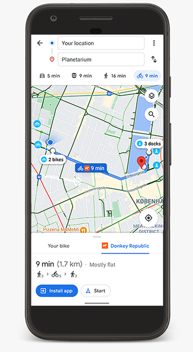

# GBFS: A Common Language for Shared Mobility

    <a class="button" href="specification">Specification</a><a class="button" href="data-quality">Data Quality</a><a class="button" href="toolbox">Toolbox</a><a class="button" href="learn">Learn</a><a class="button" href="participate">Participate</a>

<!--  -->

GBFS provides a common language for shared mobility operators to share information about services available to travelers. GBFS includes information about vehicles (bicycles, scooters, moped, and cars), stations, pricing and more:

- Vehicle, station, and dock locations and availability
- Vehicle characteristics – form factor, type of power, distance that can be traveled
- Service pricing and rental terms
- Geofenced areas for rules related to speed, parking, and prohibited zones

GBFS data is used by trip planning and Mobility as a Service (MaaS) applications, to provide information travelers need to discover and use shared mobility. Public GBFS APIs enable the integration of shared mobility services with public transportation, allowing users to make first-mile, last-mile connections.

In addition, GBFS provides municipalities and agencies with a standardized way to ingest, analyze, and compare data generated by shared mobility systems.

**Real-time information in a standardized format**

GBFS enables the exchange of information in a way that ensures all parties agree on what the information represents. You can think of it like a dictionary, where each term has a definition and a set of rules for how it can be used.

GBFS is a real-time data specification that describes the current status of a mobility system. GBFS does not support, and is not intended for, historical data such as trip or maintenance records.

